### 1. Create empty files using touch cmd under your home directory
### • Xyz1-abc
### • Xyz2-abc
### • Xyz3-abc
###      .
###      .
###      .
### • Xyz9-abc

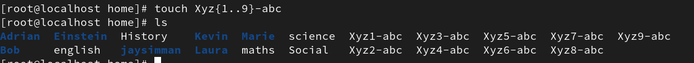

### 2. Display only these files using ls -l (tip: use wild characters - * or ?)

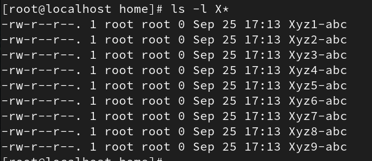

### 3. Move the files xyz1-abc, xyz2-abc, xyz5-abc to CEO/VP people /HR lead using mv cmd Note: in order to create directory with space use “VP People” or VP\ People

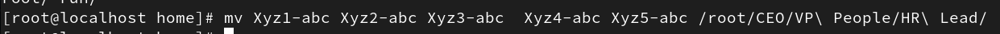

### 4. Copy the files xyz3-abc …xyz6-abc to CEO/VP Sales/Sales Lead

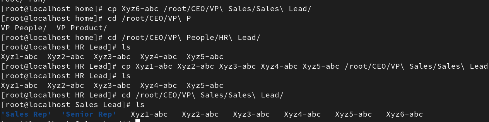

### 5. Rename the files in ‘HR lead’ to People, Address, Contact (xyz1-abc as People and so on)

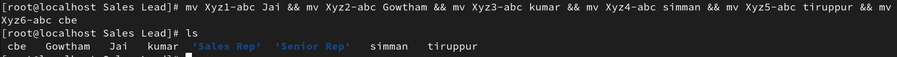

### 6. From your home directory, Use find cmd to find the file People

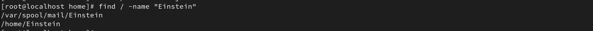

### 7. Now use locate cmd to find the Contact file. Note: If new files are created, run updatedb cmd as root user.

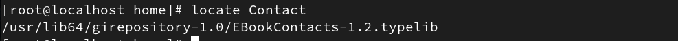

### 8. Use Echo cmd to display “This is my world !!”

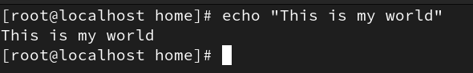

### 9. Write the output of 8 into the file – People

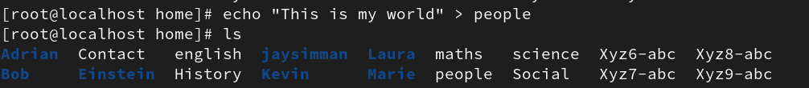

### 10. Display the contents of the file People using cat cmd

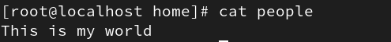

### 11. Append “My world revolves around Linux” into People.

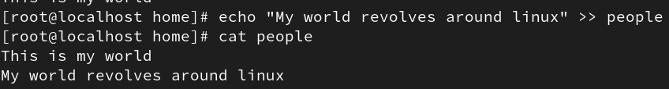

### 12. Display the contents of the file People using cat cmd

### 13. Under your user directory, run ls -l cmd and write the output into FileInfo File.

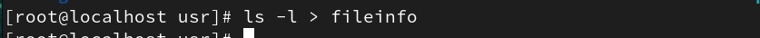

### 14. Display the contents of the file FileInfo using cat, less, more, head and tail cmd – Observe the difference between the display cmds used.

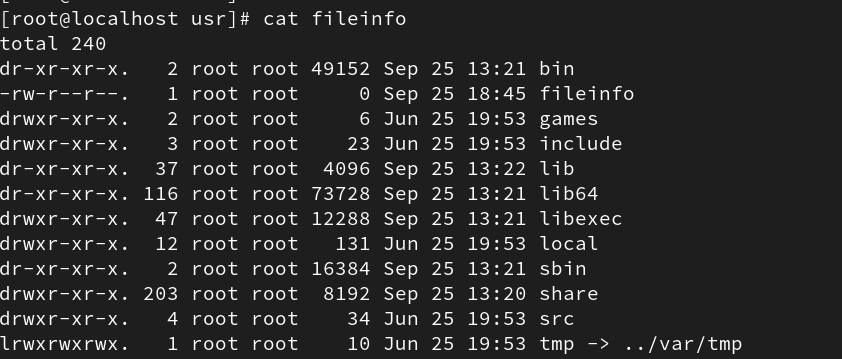
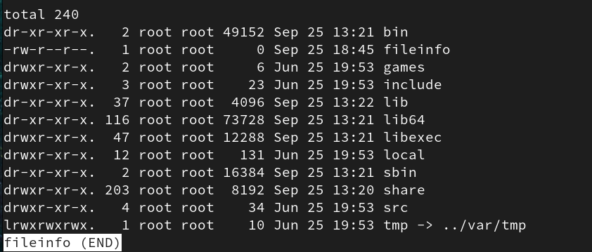
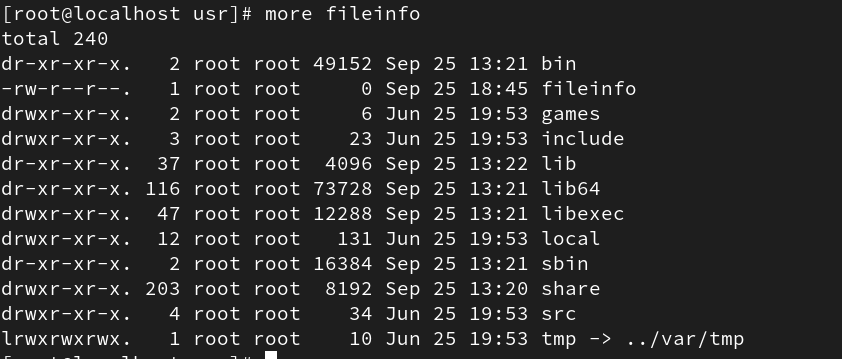
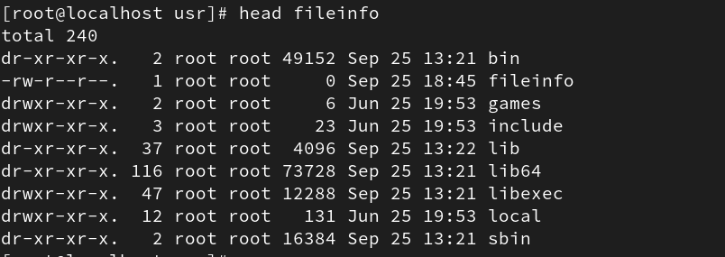
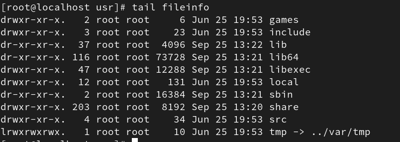

### 15. Use rm cmd to remove directories and files

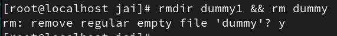

### 16. Use rmdir cmd to remove directories

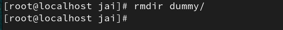

### 17. Use history cmd to get a list of all the cmds used and input that to a file.

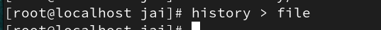