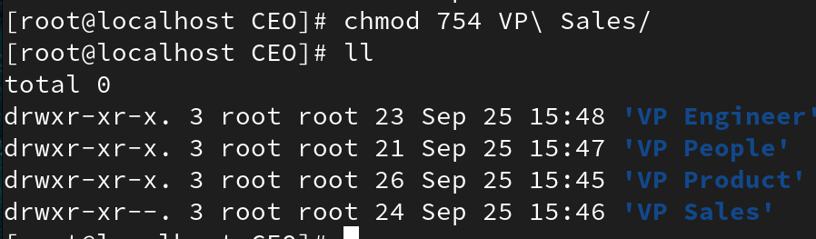

### 1. List all the files and directories in your user directory

### 2. Observe the permission for each file and directories.

### 3. For Directory give the following permission using chmod cmd 
###        a. VP Sales
###        i.  User – rwx
###        ii.  Group – r-x
###        iii.  Others – r- -

###        b. People
###        i.  User – r - -
###        ii.  Group – r- -
###        iii.  Others – r- -

###        c. Sales Rep
###        i.  User – r - -
###        ii.  Group – - - -
###        iii.  Others – r- -

### 4. For Directory give the following permission using chmod cmd using Numeric values
### a. Product Lead
### i.  User – -w-
### ii.  Group – rwx
### iii.  Others – rwx

### b. Senior Developer
### i.  User – rwx
### ii.  Group – rw-
### iii.  Others – --x

### c. Tech Lead
### i.  User – r - x
### ii.  Group – r- x
### iii.  Others – rwx
 
### 5. For the following files change permissions using chmod cmd 
### a. abc1-xyz
### i.  User – r - x
### ii.  Group – r- x
### iii.  Others – r-x

### b. abc2-xyz
### i.  User – rwx
### ii.  Group – rwx
### iii.  Others – rwx

### c. abc3-xyz
### i.  User – - - -
### ii.  Group – - -x
### iii.  Others – r--

### 6. For the following files change permissions using chmod cmd (Numeric values)
### a. abc4-xyz
### i.  User – r - x
### ii.  Group – ---
### iii.  Others – --x

### b. abc5-xyz
### i.  User – r - x
### ii.  Group – r- x
### iii.  Others – r-x

### c. abc6-xyz
### i.  User – r - x
### ii.  Group – r- x
### iii.  Others – r-x

### 7. Create a file – SoftLinkTest under your user directory, input some text and cat it to display its contents.

### 8. Repeat the same for file – HardLinkTest.

### 9.  Create softlink for file SoftLinkTest uner /tmp directory using ln-s cmd

### 10. Create hardlink for file HardLinkTest uner /tmp directory using ln cmd

### 11. Check the inodes for each file and its link.

### 12. Update the file contents and observe the changes

### 13. Delete the files and observe the changes

### 14. Create a hard and soft link for a directory of your choice and record the results.

### 15. Use cp cmd to copy a directory of your choice into CEO directory. Try with empty as well as with sub directories.

### 16. Go to /var/log, display the contents of file messages using more and less, head and tail cmd.

### 17. Go to /bin, run cmd ls -l | more

### 18. Go to /bin, run cmd ls -l | less

### 19. Go to /bin, run cmd ls -l | head

### 20. Go to /bin, run cmd ls -l | tail

### 21. Run head and tail cmd to get specified number of lines displayed eg. head -5, tail -3 etc.

### 22. Understand the use of Pipe |.

#### Combining two commands to do work in parallel