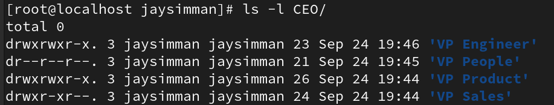

# 1. Working with Vi editor

### a. Create a file – EditorFile usinf vi cmd

### b. Insert some text of your choice – i (insert mode)

### c. Practise the following cmds .
## Exiting vi
### i. :q - quit - if you have made any changes, vi will warn you of this, and you'll need to use one of the other quits.

### ii. :w - write to disk

### iii. :w filename - write to disk as filename

### iv.:wq! - write to disk and quit

### v. ZZ - write to disk and quit

### vi. :q! - quit without writing to disk

## Inserting text
### i. a - append text after cursor *

### ii. A - append text at end of line *
### iii. i - insert text before cursor *
### iv. I - insert text at beginning of line *
### v. o - open a blank line after the current line for text input *
### vi. O - open a blank line before the current line for text input *
### *Note: hit ESC (escape) key when finished inserting!

## Deleting text
### i. x - delete character at cursor
### ii. dh - delete character before cursor
### iii. nx - delete n characters at cursor
### iv. dnw - delete n words from cursor
### v. D - delete to end of line
### vi. dd - delete current line
### vii. ndd - delete n lines (start at current line)

## Copying lines
### i. yy - "yank": copy 1 line into buffer
### ii. nyy - "yank": copy n lines into buffer
### iii. p - put contents of buffer after current line
### iv. P - put contents of buffer before current

## Searching / Substituting
### i. /str - search forward for str
### ii. ?str - search backward for str
### iii. n - find next occurrence of current string
### iv. N - repeat previous search in reverse direction
### v. :s/old/new - substitute new for first occurrence of old in current line
### vi. :s/old/new/g - substitute new for all occurrences of old in current line
### vii. :%s/old/new/g - substitute new for all occurrences of old in the entire file

# 2. User Account management (Become root user) – Create users and groups complete exercise 3 and then
## perform delete.
### a. Add users – Saurav,Robin,Ronaldo and Messi using useradd cmd

### b. Add groups – Football and Cricket using groupadd cmd

### c. Add Saurav and Robin to Cricket grp using usermod -aG groupname username

### d. Add Messi and Ronaldo to Football grp using usermod -aG groupname username

### e. Verify using id cmd – id username

### f. Verify using groups cmd – groups username

### g. Add user Dravid to group Cricket – useradd -G groupname username

### h. Add user Neymar to group Football – useradd -G groupname username

### i. Observe the files - /etc/passwd , /etc/shadow , /etc/groups

### j. Create a group players. Add all the users to Players grp.

### k. Delete user Saurav and Messi including their home directory

### l. Remove user Neymar and Dravid from Player grp using gpasswd -d username groupname

### m. Delete group Football using groupdel cmd

### n. Create group Chess and add users Pragg,Anand,vaishala and gukesh

### o. Delete user Pragg and Anand using userdel -r username and observe the changes.

### p. Add a user of your choice and add to any grp as primary group
#### i. Usermod -g groupname username

#### ii. Delete this group and observe the changes.

# 3. File Ownership commands
### a. Cricketers file under your home directory change owner to Saurav using chown username filename

### b. Sample file under your home directory change group to Cricket using chgrp grpname filename

### c. Change owner and grp of file Footballers using chown username:groupname filename

### d. For the CEO directory change owner to Neymar and grp to Football

### e. Observe the changes in its sub directories and files

### f. For the CEO directory change owner to Neymar and grp to Football using -R option

### g. Observe the changes in its sub directories and files

