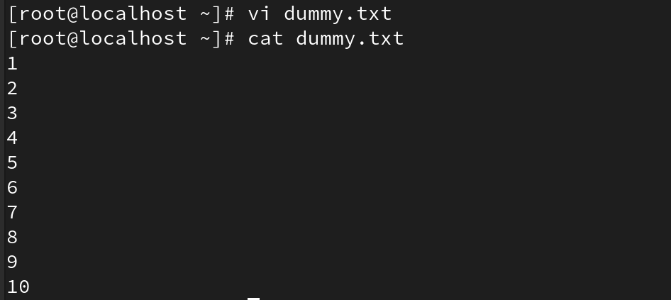
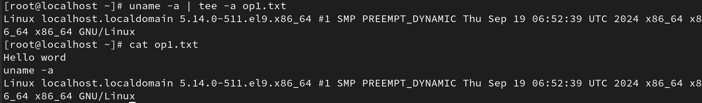
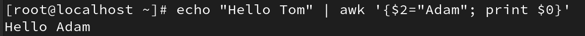

# SHEET -5 – I/O REDIRECT,FILTERS(TEE,GREP,WC)
## I/O Redirect
## Redirecting standard o/p and error
### 1. Create a file called output.txt that contains the output of the date command Note : run date cmd in the terminal and observe the o/p.

### 2. Append the current user’s name to a file called output.txt ( use whoami)

### 3. Append the host name to a file called output.txt ( use hostname)

### 4. Attempt to list a non-existent directory and redirect the error message to error.log

### 5. Run a cmd to get output and error and redirect only the output to file and display the error

### a. Use ls -l existingdir non-existentdir → e.g. ls -l CEO dir1 2>&1 > error.log

### b. Cat existingfile non-existentfile

### 6. Run a cmd to get output and error and redirect only the error to file and display the output

### 7. Run a cmd to get output and error and redirect both to combined.txt

### a. Use ls -l existingdir non-existentdir → e.g. ls -l CEO dir1  > combined.txt 2>&1

### b. Cat existingfile non-existentfile Redirecting standard i/p

### 8. Create a file with numbers. Read the file using cat cmd .

### 9. Read the same file using cat and i/p redirect e.g cat < file.txt

### 10.  Read the file  /etc/passwd file and display only last 4 lines using i/p redirect and o/p to a file 

# Filters or text processor cmds.
##    1. Tee

###    a. To output.txt echo “Hello world”  using tee cmd

###    b. Run the cmd uname -a and append it to output.txt using tee -a cmd

###    c. Run tac filename | tee Newfile | tac and observe. (tac is opposite of cat)

##    2. Grep
###    a. Create a text file named sample.txt with the following content
###    Hello World
###    Welcome to the world of Linux
###    Learning commands is fun

###    b. Use grep cmd to find word ‘world’

###    c. Use grep cmd to find word ‘world’ case-insensitive

###    d. Use grep to count how many lines contain the word "Linux" in sample.txt (use grep -c “keyword” filename)

###    e. Use grep to display lines from sample.txt that do not contain the word "fun” (option -v)

###    f. Use egrep (extended grep) to find world and fun from sample.txt

###    g. Use ls -l | grep “keyword”

###    h. Cat /etc/passwd | grep “yourname”

###    i. Create a directory named test_dir and place sample.txt and more_sample.txt inside it.

###    Use grep to search for the word "World" recursively in the directory using grep -r "World" test_dir/

###    j. Try out the options grep -An , grep -Bn and grep -Cn

##    3. Sort
###    i. Create a file with some contents and perform the following

###    ii. Sort Filename , sort -r Filename ,sort -f filename ( -f = ignore case)

###    iii. Sort -k1 Filename (display column 1)

###    iv. Sort -nk3 Filename (sort numeric data and display col 3)

###    v. Sort -u Filename (sort and uniq)

###    vi. Ls -l | sort -k9 | uniq

###    vii. Use cat file1 file2 | sort (enter some relevant text in file1 and file2)

##  4. Uniq
###    i. Create a file with some duplicate contents and perform the following
###    ii. Uniq filename

###    iii. Uniq -c filename

###    iv. Use it with sort cmd and redirect the o/p to a file. (sort filename | uniq > filename)

##    5. WC
###    i. Find the no of lines ,no of words and no. of chars in a file of your choice using wc cmd
###    using wc filename ,wc -l ,wc -w ,wc -m

##    6. Cut
###    i. Create a text file named data.txt with the following content
###    John,25,Engineer
###    Alice,30,Designer
###    Bob,22,Developer
###    Charlie,28,Manager

###    ii. Use cut to extract and display the first field.use -d and -f option

###    iii. Use cut to extract and display the names and ages (first and second fields)

###    iv. Use cut to display the first 5 characters of each line in data.txt

###    v. Run ls -l | cut -d “ ” -f 9 |sort |uniq

###    vi. Use cut to extract the username in /etc/passwd file

##     7. Awk
###    i. awk ‘{print $1}’ file = List 1st field from a file

###    ii. ls –l | awk ‘{print $1,$3}’ = List 1 and 3rd field of ls –l output

###    iii. ls –l | awk ‘{print $NF}’ = Last field of the output

###    iv. awk '/keyword/ {print}' file = Search for a specific word

###    v. echo "Hello Tom" | awk '{$2="Adam"; print $0}‘ = Replace Tom with Adam
