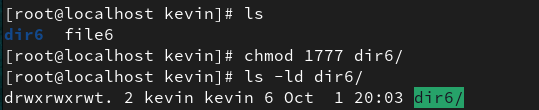
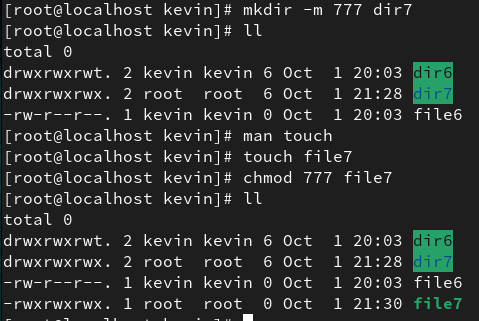

### 1. Use which cmd to check the where are its executable files
### a. Which pwd
### b. Which passwd
### c. Which su
### d. Which mount
### e. Which gpasswd

### 2. ist all the files having special permission 4 – setuid
### a. Find /usr/bin -type f -perm -4000

### b. Use find to get all files with spl perm 2- setgid from /usr/bin

### 3. List all the directories having special permission 2 – setgid from / directory (use find / -type d -perm -2000)

### 4. Run ls -l /usr/bin/gpasswd and observe the permission (-rws-r-x-r-x)

### a. Run the same for passwd and sudo and chmod and observe.

### b. Run ls -l /usr/bin/locate and observe the permission (-rwx--s--x)

### c. Run ls -l /usr/bin/write and observe the permission (-rwxr-sr-x)

### d. Run ls -ld /tmp and observe the permission (drwxrwxrwt)

### 5. Set up a directory, owned by the group sports. (setGID -4)

### a. Members of the sports group should be able to create files in this directory.

### b. All files created in this directory should be group-owned by the sports group.

### i. Use (chmod g+s dir/filename) and also using octal values (chmod 2775 dir/filename)

### c. Users should be able to delete only their own user-owned files.

### d. Check if this works.

### e. Try removing the permissions also and checking(chmod g-s dir.filename)

### 6. Create files and try setting and removing setuid permissions (setUID -2) and chk using ls -l filename
### a. Chmod u+s filename

### b. Chmod u-s filename

### c. Chmod 4764 filename

### d. Chmod 0764 filename

### 7. Become root user and create a shared full permission dir

### a. Become user kevin and create files and dirs.

### b. Login as another user and delete the files created by kevin.

### c. Now set sticky bit to the shared dir (chmod +t dirname) / chmod 1777 dirname).

### d. Again, as kevin create dirs and files inside shared folder.

### e. Login as another user and delete the files created by kevin.
