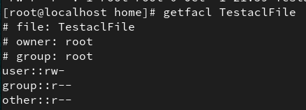

### 1. Create a directory named TestaclDir under your home directory with 755 permissions

### 2. Create a file named TestaclFile under your home directory.

### 3. Observe the permissions of dir and file created (ls -l /ls -ld)

### 4. Use getfacl cmd  to check the permissions of user and group.

### 5. Change the group of the file and dir to sports. (assuming you have a group named sports)

### 6. Add a user – Sachin to sports. (usermod -aG cmd)

### 7. Now use setfacl cmd on TestaclDir to give permission -rwx (7) for user Sourav

### a. Use setfacl -m u:username:permission file/dirname

### b. Use setfacl --no-mask -m u:username:permission file/dirname ( the grp permissions will not change)

### c. Check the acl s using getfacl

### d. Observe a + sign .

### e. Setfacl on TestaclDir  for group -Football with permissions -rwx (7)

### f. Check the acl s using getfacl

### g. Access the dir as Sourav and test the permissions before and after setting the acls.

### h. Access the dir as any user in grp Football and test the permissions before and after setting the acls.

### 8. Repeat 7. For file TestaclFile.

### 9. Remove the acl s using setfacl -x u/g :user/grp file/dirname and chk with getfacl cmd

### 10.  Remove all acls using setfacl -b file/dirname
